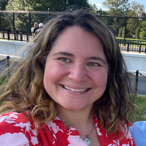

## Welcome!

I am a research consultant working with clients to design and implement innovative computational methods. I am based in the Chicago area and I work with clients around the world. I am the author of a digital research tool called [Web Historian](http:/www.webhistorian.org), and I write about trace data methodology, and political information consumption in the digital media era. I have taught courses and workshops in research methods, including introductory programming, and data analysis.

For my research publications see my [Google Scholar profile](https://scholar.google.com/citations?user=H5mrkAkAAAAJ&hl=en) or my [ORCID page](https://orcid.org/0000-0002-5029-8269). For pre-registrations, see my [Open Science Foundation profile](https://osf.io/q34xp/). 

Elsewhere around the web you can me on [Github](https://github.com/erickaakcire/), and Mastodon <a rel="me" href="https://sciences.social/@ericka">@ericka@sciences.social</a>

<!-- For all of that and more see [my CV](emt-cv-web.pdf) -->
